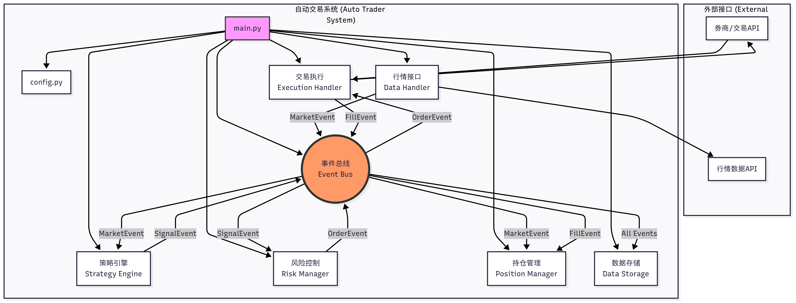
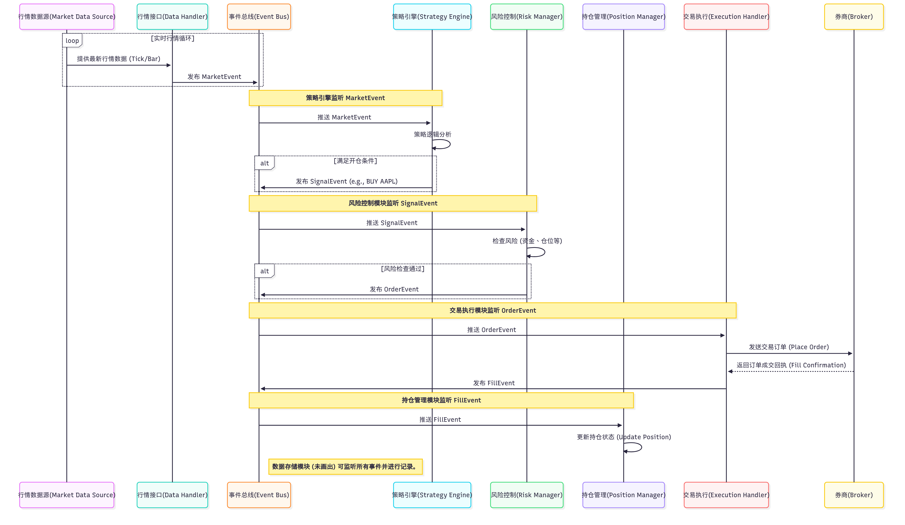

# 自动股票交易系统 (Auto Stock Trading System)

https://github.com/yejingwei97/SmartTrader

这是一个基于事件驱动架构的模块化股票自动交易系统。

## 系统架构

### 模块关系图 (Module Relationship Diagram)

下图展示了系统中的核心组件以及它们如何通过 `事件总线 (Event Bus)` 连接和交互。

### 数据流示意图 (Data Flow Diagram)

下图以一次完整的交易生命周期为例，展示了数据（事件）如何在系统中的不同模块之间流动。

